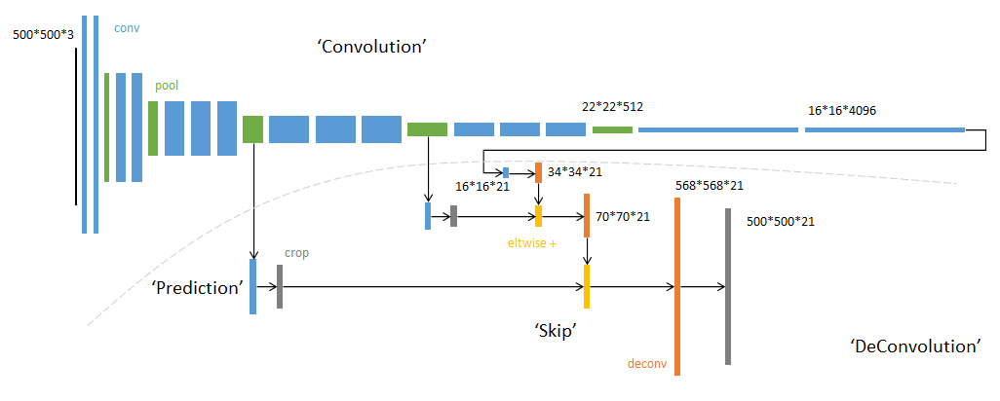
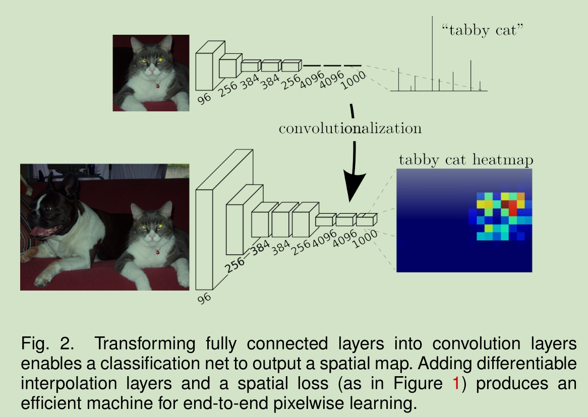
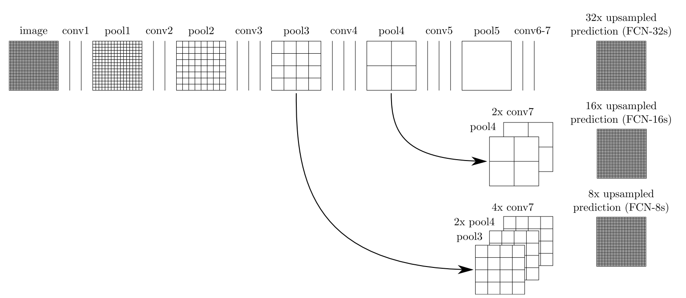
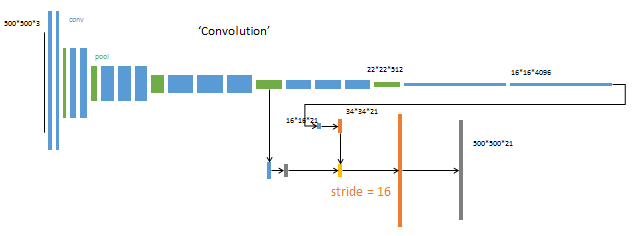
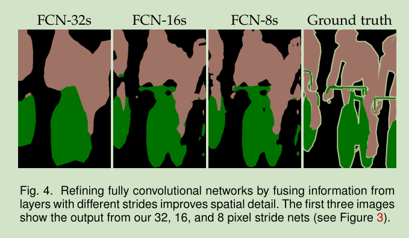
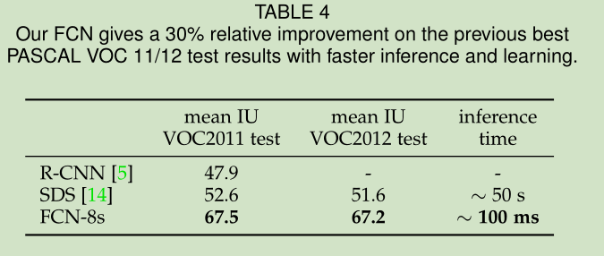
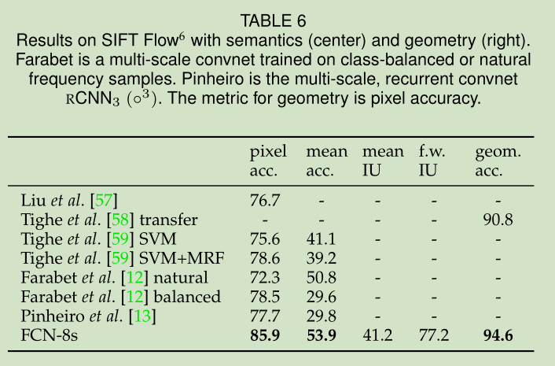
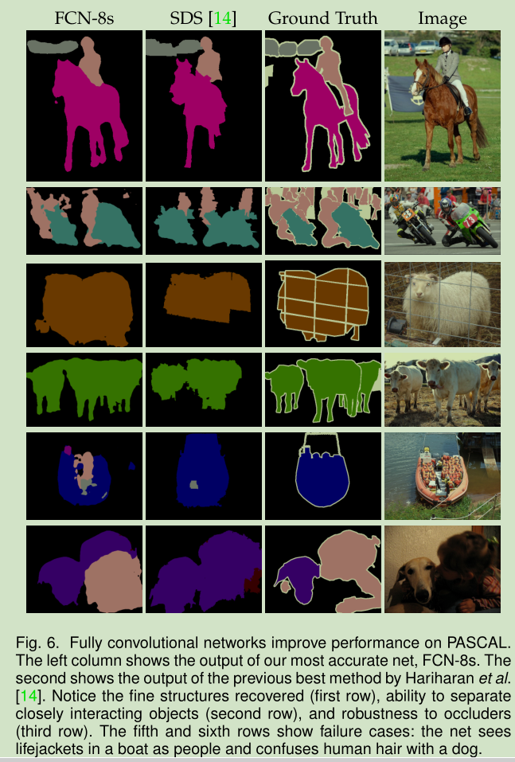

# FCN论文阅读笔记

[toc]
&emsp;&emsp;FCN原文链接：[Fully Convolutional Networks for Semantic Segmentation](https://arxiv.org/abs/1411.4038)
&emsp;&emsp;FCN代码链接：[FCN github](https://github.com/shelhamer/fcn.berkeleyvision.org)

&emsp;&emsp;[参考](https://blog.csdn.net/qq_36269513/article/details/80420363)
## 一、FCN简介
&emsp;&emsp;FCNs替换之前的经典网络Alexnet,VGGs,Googlenet等网络结构中的全连接层为卷积层提升了网络的训练速度，采用迁移学习的训练方式对网络进行优化，同时采用skip（现如今大部分网络都会采用的方式）融合低层细节信息和高层语义信息提升网络的性能，是第一个端到端的语义分割网络。

## 二、FCN结构

### 1、全卷积网络
&emsp;&emsp;卷积网络的基本结构包含卷积层，池化层，激活层和全连接层，一般都是以一个层接一层排列，前一层的大小为$h*w*d$，其中$h,w$为输入数据的高和宽，$d$为该层神经元的通道数也即是个数。假设上一层的输入为$h*w*d$，且在$(i,j)$处的输入数据为$x_{ij}$则输出为:
$$
y_{ij}=f_{ks}(\lbrace {X_{si+\sigma i, sj+\sigma j}}_{0\le \sigma i, \sigma j \lt k} \rbrace )
$$
其中k是可大小，s是补偿，$f_{ks}$标是该层的类型。和其他网络不同的地方是FCNs中的$f_{ks}$没有全连接层，也就是说整个网络中只包含卷积层，池化层和激活层。如下图所示，上半部分是一个正常的分类网络，后三层分别是4096，4096，1000通道的全卷积层，而FCNs中将后三层换成卷积层。传统的CNN使用的全连接层会使得网络丢失部分细节信息且限制了网络的输入大小，替换为全卷积之后可以保留部分细节的同时保证网络能够适应任何尺寸的图像，当然代价是性能上的损失。

### 2、上采样
&emsp;&emsp;关于上采样，作者专门用了一小节介绍了空洞卷积（dilated convolution）但是也明确表示网络中并不会使用该结构，而是在3.3节中多次强调线性插值和deconvolution（一般翻译成去卷积，更准确的翻译应该是转置卷积，来自于ZFNet），使用deconvolution可以保证网络的上采样是可学习的，而且相比于其他方法更高效。另外，deconvolution在反向传播中其实就是convolution的相反过程。

### 3、SKIP
&emsp;&emsp;将底层次的feature和高层次的feature结合，这样可以融合二者的细节信息和语义信息

## 三、实验结果
### 1、训练
&emsp;&emsp;第一阶段，以经典的网络Alexnet，googlnet，vgg等的网络结构为基础去除后面的全连接层为卷积层：

&emsp;&emsp;第二阶段，原始网络的输出为16\*16\*4096最后得到分割的预测图16\*16\*21(21是对应的类别数量)，之后直接上采样为目因为最后上采样32倍因此为FCN-32s。

&emsp;&emsp;第三阶段将第四个pooling层的预测结果使用skip结构和最终的输出融合，最后上采样16倍，称为FCN-16s。

&emsp;&emsp;第三阶段将第三个pooling层的预测结果使用skip结构和最终的输出融合，最后上采样8倍，称为FCN-8s。

### 2、实验结果
#### 1)、相同网络不同结构的对比
&emsp;&emsp;可以明显的看到8s相较于其他两个结构在结果上更加精细而且边界效果更好。

#### 1)、不同网络结构的对比
&emsp;&emsp;指标，其中$n_{ij}$表示类别i被预测为类被j的数量，$n_{cl}$表示类别的数量$t_i$表示类别i的像素的总数：
- 像素准确率：$\frac{\sum_{i} n_{ii}}{\sum_it_i}$
- 平均准确率：$\frac{1}{n_{cl}} \frac{\sum_in_{ii}}{t_i}$
- 平均IU：$\frac{1}{n_{cl}}\frac{\sum_in_{ii}}{t_i+\sum_jn_{ji}-n_{ii}}$
- 加权IU：$\frac{(\sum_kt_k)^{-1}\sum_it_in_{ii}}{t_i+\sum_jn_{ji}-n_{ii}}$

## 四、FCNs的缺陷
- FCNs无法利用不同像素点之间的关联信息；
- FCNs的速度比较慢；
- FCNs的分割不是实例级别的（区分个体）