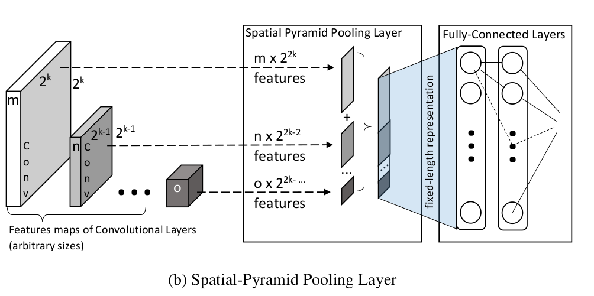
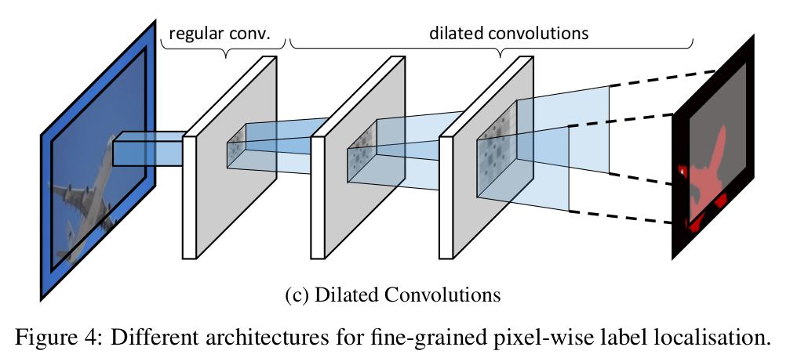
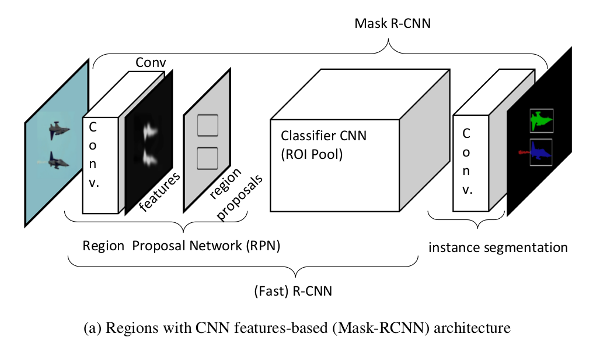

# 《A SURVEY ON DEEP LEARNING-BASED ARCHITECTURES FOR SEMANTIC SEGMENTATION  ON 2D IMAGES》论文翻译

论文地址:[A SURVEY ON DEEP LEARNING-BASED ARCHITECTURES FOR SEMANTIC SEGMENTATION  ON 2D IMAGES](http://xxx.itp.ac.cn/pdf/1912.10230.pdf)
[toc]

```mermaid
    graph LR
   tran[传统超像素或者CRF.2013] ==> recurr[Recurr CNN.2014]
   recurr ==> fcn[FCN.2014]
   fcn ==> deeplabv1[DeepLabV1.2014]
   deeplabv1 ==> cmsa[CMSA.2015]
   cmsa ==> unet[U-Net.2015]
   unet ==> segnet[SegNet.2015]
   segnet ==> deconvnet[DeconvNet.2015]
   deconvnet ==> mscg[MSCG.2015]
   mscg ==> crfrnn[CRF-RNN.2015]
   crfrnn ==> featmap[FeatMap-Net.2016]
   featmap ==> deeplabv2[DeepLabV2.2016]
   deeplabv2 ==> pspnet[PSPNet.2017]
   pspnet ==> deeplabv3[DeepLabV3.2017]
   deeplabv3 ==> dis[DIS.2017]
   dis ==> maskrcnn[Mask-RCNN.2017]
   maskrcnn ==> gcn[GCN.2017]
   gcn ==> dfn[DFN.2018]
   dfn ==> msci[MSCI.2018]
   msci ==> deeplabv3p[DeepLabV3+.2018]
   deeplabv3p ==> hpn[HPN.2018]
   hpn==>encnet[EncNet.2018]
   encnet ==> psanet[PSANet.2018]
   psanet ==> exfuse[ExFuse.2018]
   exfuse ==> emanet[EMANet, 2019]
   emanet ==> ksac[KSAC.2019]
   ksac ==> cfnet[CFNet.2019]
   cfnet ==> sdn[SDN.201]
   sdn ==> yolact[YOLACT.2019]

   style tran fill:#f9f,stroke:#333,stroke-width:4px,fill-opacity:0.5
   style recurr fill:#f9f,stroke:#333,stroke-width:4px,fill-opacity:0.5
   style fcn fill:#f9f,stroke:#333,stroke-width:4px,fill-opacity:0.5
   style deeplabv1 fill:#f9f,stroke:#333,stroke-width:4px,fill-opacity:0.5
   style cmsa fill:#f9f,stroke:#333,stroke-width:4px,fill-opacity:0.5
   style unet fill:#f9f,stroke:#333,stroke-width:4px,fill-opacity:0.5
   style segnet fill:#f9f,stroke:#333,stroke-width:4px,fill-opacity:0.5
   style deconvnet fill:#f9f,stroke:#333,stroke-width:4px,fill-opacity:0.5
   style mscg fill:#f9f,stroke:#333,stroke-width:4px,fill-opacity:0.5
   style crfrnn fill:#f9f,stroke:#333,stroke-width:4px,fill-opacity:0.5
   style featmap fill:#f9f,stroke:#333,stroke-width:4px,fill-opacity:0.5
   style deeplabv2 fill:#f9f,stroke:#333,stroke-width:4px,fill-opacity:0.5
   style pspnet fill:#f9f,stroke:#333,stroke-width:4px,fill-opacity:0.5
   style deeplabv3 fill:#f9f,stroke:#333,stroke-width:4px,fill-opacity:0.5
   style dis fill:#f9f,stroke:#333,stroke-width:4px,fill-opacity:0.5
   style maskrcnn fill:#f9f,stroke:#333,stroke-width:4px,fill-opacity:0.5
   style gcn fill:#f9f,stroke:#333,stroke-width:4px,fill-opacity:0.5
   style dfn fill:#f9f,stroke:#333,stroke-width:4px,fill-opacity:0.5
   style msci fill:#f9f,stroke:#333,stroke-width:4px,fill-opacity:0.5
   style deeplabv3p fill:#f9f,stroke:#333,stroke-width:4px,fill-opacity:0.5
   style hpn fill:#f9f,stroke:#333,stroke-width:4px,fill-opacity:0.5
   style encnet fill:#f9f,stroke:#333,stroke-width:4px,fill-opacity:0.5
   style psanet fill:#f9f,stroke:#333,stroke-width:4px,fill-opacity:0.5
   style exfuse fill:#f9f,stroke:#333,stroke-width:4px,fill-opacity:0.5
   style emanet fill:#f9f,stroke:#333,stroke-width:4px,fill-opacity:0.5
   style ksac fill:#f9f,stroke:#333,stroke-width:4px,fill-opacity:0.5
   style cfnet fill:#f9f,stroke:#333,stroke-width:4px,fill-opacity:0.5
   style sdn fill:#f9f,stroke:#333,stroke-width:4px,fill-opacity:0.5
   style yolact fill:#f9f,stroke:#333,stroke-width:4px,fill-opacity:0.5
```
## 摘要
&emsp;&emsp;语义分割是对一张图像进行像素级的分类。由于语义分割问题被定义为像素级，意味着仅仅是图像的分类是不够的，还需需要在原图像上进行像素级的分辨率进行定位。卷积神经网络卓越的能力推动了创建语义级别，高层次和高纬度的图像特征；在过去十年里(论文发表是2019/12/25)已经提出了过多的基于深度学习的2D图像语义分割方法。在这个调查中我们主要集中于最新的语义分割科学发展，特别是基于深度学习的方法对2D图像进行语义分割的方法。我们首先分析了用于2D语义分割的公共图像集和排行榜，并概述了性能评估中采用的技术。在考察该领域的发展过程中，我们按时间顺序将这些方法分为三个主要阶段，早期深度学习时代（pre-and early deep learning era），完全卷积的时代（the fully convolutional era）和FCN后的时代（post-FCN era）。我们从技术上分析了提出的解决方案，这些解决方案是为解决该领域的基本问题而提出的，例如细粒度的定位和尺度不变性。在得出结论之前，我们列出了所有提到的时代的方法，并简要介绍了每种方法的摘要，以解释它们对这一领域的贡献。我们通过讨论该领域的当前挑战以及在多大程度上解决了这些挑战来结束调查。
## 1. 简要
&emsp;&emsp;语义分割最近已成为基本问题之一，并且成为计算机视觉和机器学习领域的热门话题。 为图像的每个像素分配一个单独的类别标签是构建复杂的机器人系统（如无人驾驶汽车/无人机，人类友好型机器人，机器人辅助手术和智能军事系统）的重要步骤之一。 这也难怪除了科学机构，研究人工智能的行业领先公司现在也正面临这个问题。
&emsp;&emsp;语义分割最简单的问题定义是像素级标记。 由于问题是在像素级别定义的，因此仅查找场景中包含的类别标签被认为是不够的，但是以原始图像像素分辨率定位标签也是一个基本目标。 根据上下文，类标签可能会更改。 例如，在无人驾驶汽车中，像素标签可以是人，道路和汽车[1]，而在医疗系统[2、3]中，像素标签可以是癌细胞，肌肉组织，主动脉壁等。
&emsp;&emsp;不可否认，最近对这个话题的兴趣增加是由卷积神经网络[4]（CNN）所取得的非凡成功所引起的，该卷积神经网络已被带入语义分割。 在语义层次上理解场景一直是计算机视觉的主要主题之一，但是直到现在，我们才看到解决该问题的实际方法。
&emsp;&emsp;在本文中，我们的主要动机是关注语义分割的最新科学进展，特别是基于深度学习的使用2D图像的方法。我们将调查范围缩小到仅使用2D可见图像的技术的原因是，在我们看来，文献中的问题规模如此之大和广泛，以至于无法对所有语义分割模式进行分析和分类（例如（例如3D点云，高光谱数据，MRI等）的详细程度。除了分析使语义分割成为可能和准确的技术之外，我们还将检查为此问题创建的最受欢迎的数据集。此外，我们回顾了用于评估语义分割成功与否的性能指标。最重要的是，我们提出了一种新颖的可以洞察现有的不足之处并为该领域提出未来的方向的分类方法。
&emsp;&emsp;本文的其余部分安排如下：在以下小节中，我们将参考有关该主题的其他调查研究，并强调我们的贡献。 第2节介绍了有关不同数据集，挑战以及如何衡量语义分割性能。 从第3节开始，我们按时间顺序详细检查了三个主要标题下的语义分割方法，因此在三个单独的部分中进行了详细的研究。 第3节介绍了深度卷积神经网络之前和早期的方法。 第4节提供了有关语义分割里程碑的全卷积神经网络的详细信息。 第5节介绍了有关该问题的最新方法，并提供了有关这些方法的体系结构细节和成功与否的详细信息。 最后，第6节为本文的结论。

### 1.1 语义分割调查
&emsp;&emsp;最近，在学术界和工业界的推动下，人们对语义分割的兴趣迅速增加，不可避免地发表了许多调查研究的[5、3、1、6、7、8、9、10]。
&emsp;&emsp;其中一些调查着眼于特定问题，例如地平线/天际线检测的语义分割方法的对比[5]，而其他调查则涉及与工业挑战相关的相对广泛的问题，例如无人驾驶汽车的语义分割[1]或医疗系统的语义分割[3]。如果研究相同的特定问题，这些研究会很有用，可能“在技术上”有助于该领域的未来发展方向，但是他们缺少一个愿景。
&emsp;&emsp;另一组[6、7、8、9]的语义分割调查研究提供了对该主题的总体概述，但它们缺乏有关基于深度学习的方法的必要深度分析。尽管在深度学习之前对语义分割进行了二十年的研究，但直到最近才实现了对该领域的实际贡献，特别是在一篇关于全卷积网络（FCN）的革命性论文[11]之后（在本文中也对此进行了详尽的分析） ）。可以说，大多数最新研究实际上是同一研究的扩展[11]。因此，如果不仔细分析FCN和后续论文的方向，调查研究将缺乏使用深度学习检查语义分段的必要学术严谨性。
&emsp;&emsp;另一方面，关于语义分割的大多数最新研究[12，13]在单独的部分中提供了对文献的可靠分析。由于这些研究主要是关于一种新方法的提议，因此分析通常很简短，并且在捍卫论文自己的贡献或立场时有些偏颇。因此，此类论文无法充分匹配或满足调查所提供的深度，而调查通过无偏见的检查和展望逻辑上涵盖了所有相关技术。
&emsp;&emsp;Garcia-Garcia等人对深度语义分割的最新综述。 [10]对此问题进行了全面调查。他们涵盖了几乎所有流行的语义分割数据集和方法，并涵盖了所有模态，例如2D，RGB，2.5D，RGB-D和3D数据。尽管从涉及深度语义分割的大多数相关材料的意义上说，这项研究是包容性的，但由于调查试图涵盖语义分割文献主题下的几乎所有内容，因此方法的分类是粗糙的。最近关于语义分割的深度学习研究遵循了许多基本方向和努力来解决各种相应的问题。在这份调查报告中，我们定义和描述了这些新挑战，并在此建议的背景下对所有研究进行了新颖，一致的分类。这样，我们相信读者会更好地了解当前的最新技术以及2D语义分割的未来方向。
## 2 数据集，挑战和性能指标
### 2.1 数据集和挑战
&emsp;&emsp;毫无疑问，任何机器学习应用的成功水平都取决于用于训练的数据的质量和深度。 当涉及到深度学习时，数据就显得尤为重要，因为大多数系统都是端对端的，因此，即使功能是由数据决定的，而不是为了数据存在的。 因此，在深度学习的情况下，数据不再是对象，而是成为实际的主题。
&emsp;&emsp;在本节中，我们将研究已用于语义分割问题的最流行的大规模2D数据集。这些数据集分为两个主要分支，即通用数据集，其通用类别标签包括几乎每种类型的对象或背景，还有城市街道数据集，其中包括诸如汽车和人的类别标签，通常会创建用于无人驾驶汽车系统的培训。还有许多其他未解决的2D语义分割问题域，例如医学成像，卫星图像或红外图像。但是，由于城市街道数据吸引了行业的更多关注，目前正在推动该领域的科学发展。非常大型的数据集和拥挤的排行榜存在的挑战仅适用于工业用户。基于深度的语义分割的科学兴趣正在迅速增长。然而，如引言中所述，我们从当前研究中排除了基于深度的3D分割数据集，以便将足够的细节集中在与2D语义分割相关的最新技术的新颖分类上。

#### 2.1.1 通用语义分割数据集
- &emsp;&emsp;PASCAL视觉目标类别（VOC）[14]：该数据集不仅包含图像注释，用于语义分割，而且还用于分类，检测，动作分类和人员布局任务。 数据集和注释会定期更新，挑战排行榜是公开的（仅针对细分挑战就有100多个提交内容）。 它在语义分割挑战中最受欢迎，并且在2005年首次发布后仍然活跃。PASCALVOC语义分割挑战数据集包括20个前景对象类和一个背景类。 原始数据包括用于训练目的的1,464张图像，以及用于验证的1,449张图像。 1,456张测试图像对挑战者保密。 该数据集包括所有类型的室内和室外图像，并且在所有类别中都是通用的。
  &emsp;&emsp;PASCAL VOC数据集具有许多扩展数据集，其中最流行的是PASCAL Context[15]和PASCAL Parts[16]。第一个[15]是PASCAL VOC 2010的一组附加注释，它通过为整个场景提供注释而超出了原始的PASCAL语义分割任务。统计信息部分包含400多个标签的完整列表（相比之下，原始21个标签）。第二个[16]也是PASCAL VOC 2010的一组附加注释。它为对象的每个身体部位（例如分别标记的动物肢体）提供了分割蒙版。对于这些扩展，训练和验证集包含10,103张图像，而测试集包含9,637张图像。使用其他功能注释的PASCAL VOC还有其他扩展，例如语义部分（PASParts）[17]图像集和语义边界数据集（SBD）[18]。例如，PASParts [17]还提供了“实例”标签，例如图像中对象的两个实例被分别标记，而不是使用单个类标签。但是，与前两个附加扩展[16，15]不同，这些扩展[17，18]被证明不那么受欢迎，因为它们的挑战在最新的语义细分研究中吸引了较少的关注，因此它们的排行榜是没那么挤。在图1中，描述了示例对象，零件和实例分割。

- &emsp;&emsp;上下文中的通用目标（COCO）[19]：带有20万个标记图像，150万个对象实例和80个对象类别，COCO是非常大型的对象检测，语义分割和字幕图像集，包括几乎所有可能的场景类型。 COCO不仅在实例级和像素级（它们称为“填充”）语义分割方面提出了挑战，而且还引入了一项新的任务，即全景分割[20]，该任务旨在统一实例级和像素级细分任务。 由于数据规模，他们的排行榜2相对不那么拥挤。 另一方面，出于同样的原因，他们的挑战仅由最具雄心的科学和工业团体评估，因此被视为其排行榜中的最新技术。
- &emsp;&emsp;其他通用语义分割数据集：尽管不如PASCAL VOC或COCO流行，但在同一域中还有一些其他数据集。 [21]中介绍了YouTube-Objects，它是一组低分辨率（480×360）的视频剪辑，具有超过10k像素注释帧。 类似地，SIFT流[22]是另一个具有33个类别标签的低分辨率（256×256）语义分割图像集，总共2688张图像。 这些和其他相对原始的图像集由于其有限的分辨率和较小的体积而在语义分割文献中已被大部分抛弃。

### 2.1.2 城市街道语义分割数据集
- &emsp;&emsp;Cityscapes [23]：这是一个大型数据集，着重于对城市街道场景的语义理解。 它包含来自50个不同城市的高分辨率图像的注释，这些注释是在一天的不同时段和一年中的所有季节拍摄的，并且具有不同的背景和场景布局。 注释以两个质量级别执行：对5,000张图像进行高质量像素级注释，对20,000张图像进行弱注释。 有30种不同的类别标签，其中一些还带有实例注释（车辆，人，车手等）。 因此，使用单独的公共排行榜3存在两个挑战：一个挑战用于像素级语义分段，第二个挑战用于实例级语义分段。 挑战共有100多个条目，这使得它在有关城市街道场景的语义分割方面最受欢迎。
- &emsp;&emsp;其他城市街道语义分割图像集：有许多可供选择的城市街道语义分割数据集，例如CamVid [24]，KITTI [25]和SYNTHIA [26]。 由于种种原因，这些通常被Cityscapes数据集[23]所掩盖。 原则上，它们的规模相对较低。 只有SYNTHIA图像集[26]可以被认为是大规模的（带注释的图像超过13k）； 但是，它是人为生成的图像集，对于无人驾驶汽车等对安全至关重要的系统，这被认为是一个主要限制。

### 2.2 性能指标
&emsp;&emsp;评估语义分割的性能有两个主要标准：准确性，换句话说，算法的成功； 以及在速度和内存要求方面的计算复杂性。 在本节中，我们将分别分析这两个条件。

#### 2.2.1 准确率
&emsp;&emsp;测量细分的性能可能很复杂，这主要是因为要测量两个不同的值。 第一个是分类，它只是确定像素级的分类标签； 第二个是定位，或者找到包围对象的正确像素集。 可以在文献中找到不同的度量标准来测量这些值中的一个或两个。 以下是对最常用的评估语义分段性能的主要措施的简要说明。
- &emsp;&emsp;ROC-AUC：ROC代表接收者-操作者特征曲线，该曲线总结了使用不同概率阈值的预测模型的真阳性率和假阳性率之间的权衡； 而AUC代表该曲线下的面积，最大为1。 该工具在解释二分类问题时很有用，并且在观察值在类之间达到平衡时适用。 但是，由于大多数语义分割数据集[14、15、16、17、18、19、23]在类之间不平衡，因此最流行的挑战不再使用此度量。
- &emsp;&emsp;像素精度：也称为全局精度[27]，像素精度（PA）是一种非常简单的指标，用于计算正确分类的像素数量与其总数之间的比率。 平均像素精度（mPA）是此指标的一种版本，它可以按类别计算正确像素的比例。 mPA也称为类别平均准确度[27]。其中，$n_{jj}$是被分类并标记为类$j$的像素总数。 换句话说，$n_{jj}$对应于类$j$的“正阳性”总数。 $t_j$是标记为类$j$的像素总数。
$$
PA=\frac{\sum^{k}_{j=1}n_{jj}}{\sum_{j=1}^{k}t_j}
$$
$$
mPA=\frac{1}{k}\sum^{k}_{j=1}\frac{n_{jj}}{t_j}
$$
- &emsp;&emsp;交并比（IoU）：也称为Jaccard索引，IoU是用于比较样本集的相似性和多样性的统计信息。 在语义分割中，它是逐像素分类结果与基本事实的交集与它们的并集之比。其中，$n_{ij}$是被标记为类$i$但被分类为类$j$的像素数。 换句话说，它们是类$j$的误报（误报）。 类似地，标记为$j$类但分类为$i$类的像素总数$n_{ji}$是$j$类的假阴性（缺失）。 IoU的两个扩展版本也被广泛使用：
$$
IoU=\frac{ \sum_{j=1}^{k}n_{jj} }{ \sum_{j=1}^{k}(n_{ij} + n_{ji} + n_{jj}) }, i\neq j
$$
&emsp;&emsp;mIou(平均交并比):mIoU是IoU的类别平均：
$$
mIoU=\frac{1}{k}\sum_{j=1}^{k}\frac{n_{jj}}{ n_{ij} + n_{ji} + n_{jj} },i\neq j
$$
&emsp;&emsp;FwIoU(频权交并比):这是mIoU的改进版本，它通过使用$t_j$（标记为$j$类的像素总数）来根据出现频率权衡每个类的重要性。 FwIoU的下面的公式中给出：
$$
FwIoU=\frac{1}{\sum_{j=1}^{k}t_j}\sum_{j=1}^{k}t_j\frac{n_{jj}}{ n_{ij} + n_{ji} + n_{jj} },i\neq j
$$
&emsp;&emsp;IoU及其扩展可计算出真阳性（命中）与假阳性（假警报），假阴性（未命中）和真阳性（命中）之和的比率。 因此，与像素精度相比，IoU度量的信息量更大，这仅仅是因为它考虑了错误警报，而PA则没有。 但是，由于分母中汇总了错误的警报和未命中，因此使用此度量标准无法衡量它们之间的重要性，这被认为是其主要缺点。 另外，IoU仅测量正确标记的像素数量，而不考虑分割边界的精确度。
- 基于精确召回曲线（PRC）的指标：精确度（命中率与命中率和错误警报总和之比）和召回率（命中率与命中率和未命中之总比）是PRC的在二分类任务的变化阈值下描述精度和召回率之间存在权衡的坐标轴。 PRC与ROC非常相似。 但是，PRC在区分误报（警报）和误报（遗漏）之间的影响方面更为强大。 这就是为什么基于PRC的度量标准通常用于评估语义细分的性能的原因。 给定类j的精确度（也称为特异性）和召回率（也称为灵敏度）的公式在下面：
$$
Prec=\frac{n_{jj}}{n_{ij} + n_{jj}}, Recall=\frac{n_{jj}}{n_{ji} + n_{jj}},i\neq j
$$
&emsp;&emsp;RPC主要有三个基本的度量指标：
&emsp;&emsp;$F_{score}$:也称为“骰子系数”，此度量是给定阈值的精度和查全率的谐波平均值。 它是相似性的标准化度量，范围在0到1之间。
$$
F_{score}=2 \times \frac{Precision \times Recall}{Precision + Recall}
$$
&emsp;&emsp;$RPC_AuC$:这类似于ROC-AUC指标。 它和PRC下面的区域的简化版。 此度量标准是指有关不同阈值的精确调用权衡的信息，而不是PR曲线的形状。
&emsp;&emsp;$AP(平均准确率)$:该度量是一个单一值，它总结了PRC的形状和AUC。 为了使用AP计算AP，对于统一采样的召回值（例如0.0、0.1、0.2，...，1.0），要记录精度值。 这些精度值的平均值称为平均精度。 这是用于语义细分的最常用的单值度量。 同样，平均平均精度（mAP）是AP值的平均值，以每个类别为基础计算。

&emsp;&emsp;在最流行的语义分割挑战中，IoU及其变体以及AP是最常用的准确性评估指标[14、15、16、17、18、19、23]。
#### 2.2.2 计算复杂度
&emsp;&emsp;使用两个主要指标评估计算的负担：算法完成的速度以及需要多少计算内存。
- &emsp;&emsp:执行时间：这是整个处理时间，从将单个图像引入系统/算法的那一刻开始，一直到获得逐像素语义分割结果为止。该指标的性能很大程度上取决于所使用的硬件。因此，对于算法，任何执行时间度量都应随附所用硬件的完整描述。有诸如Big-O之类的符号，它们提供了独立于实现域的复杂性度量。但是，这些表示法具有很高的理论性，因此对于诸如深度语义分段之类的极其复杂的算法，由于它们简单且很大程度上不准确，因此不被首选。
&emsp;&emsp;对于基于深度学习的算法，离线（即，训练）和在线（即，测试）操作可能持续相当不同的时间间隔。从技术上讲，执行时间仅指在线操作，或者从理论上讲是指单个图像的测试持续时间。尽管此度量标准对于工业应用极为重要，但学术研究并未公布确切的执行时间，并且上述任何挑战均未找到提供该度量标准的方法。在最近的一项研究中，[28]提供了精度（MIoU％）与每秒帧数的二维直方图，其中一些带有开放源代码的最新技术（包括其建议的结构，即图像级联网络（ICNet），使用Cityscapes [23]图像集进行了基准测试。
- &emsp;&emsp:内存使用：当在智能手机，数码相机等性能有限的设备中使用语义分段时，或者在系统要求极为严格的情况下，内存使用特别重要。 其中最主要的例子是军事系统或对安全至关重要的系统，例如自动驾驶汽车。
&emsp;&emsp;诸如语义分段之类的复杂算法的内存使用情况在操作期间可能会发生巨大变化。 这就是为什么为此目的一个通用指标是峰值内存使用情况，它只是单个图像整个分段操作所需的最大内存。 该度量标准可能适用于计算机（数据）内存或GPU内存，具体取决于硬件设计。
&emsp;&emsp;尽管对于工业应用至关重要，但通常无法将其用于任何上述挑战。

## 3 FCNs前的方法
&emsp;&emsp;如引言中所述，FCN的使用是语义分割文献的一个突破点。 可以将FCN之前的语义细分文献[11]的工作分为两个单独的分支，作为预深度学习和早期深度学习方法。 在本节中，我们简要讨论两种方法。
### 3.1 前深度学习方法
&emsp;&emsp;传统图像分割和语义分割之间的区别因素是在处理过程中语义特征的利用。图像分割的常规方法，例如阈值化，聚类和区域增长等（请参见[29]进行常规图像分割技术的调查），利用手工制作的低级特征（即边缘，斑点）来定位对象边界。图片。因此，在图像的语义信息对于逐像素分割是必需的情况下，例如在相互遮挡的相似对象中，这些方法通常会返回较差的性能。
&emsp;&emsp;关于在深度CNN流行之前的语义分段工作，各种各样的方法[30，31，32，33，34，35，36，37，38，39，40，41，42]利用图形模型，例如Markov随机场（MRF），条件随机场（CRF）或基于森林的（或有时称为“整体”）方法，以便在像素级别查找场景标签。主要思想是通过观察相邻像素之间的依赖关系来找到一个推断。换句话说，这些方法将图像的语义建模为相邻像素之间的一种“先验”信息。感谢深度学习，今天我们知道图像语义需要对大规模数据进行抽象利用。最初，基于图的方法被认为具有这种潜力。所谓的“超像素化”
&emsp;&emsp;通常在这些研究中使用的术语是对抽象区域进行建模的过程。但是，对于这些方法，从未实现大规模数据处理的实用可行的实现方式，而对于深层CNN则首先通过[43]，然后在许多其他研究中实现了这种方式。
&emsp;&emsp;另一组研究（有时称为“分层模型” [44、45、46]）使用了一组经过预训练和分离的对象检测器，以便从图像中提取语义信息。由于各个物体探测器无法正确地对区域进行分类，或者由于该方法受到“手动选择”的探测器组通常提供的有限数量的物体类别的限制，因此与今天的状态相比，它们的性能相对较低。最先进的方法。
&emsp;&emsp;尽管深度学习前时代的上述方法不再被用作分割方法，但是一些图形模型（尤其是CRF）目前正在由最新技术用作后处理（优化）层为了提高语义分割性能，将在以下部分中讨论其详细信息。

#### 3.1.1 提炼方法
&emsp;&emsp;深度神经网络在提取抽象局部特征方面功能强大。但是，它们缺乏利用全局上下文信息的能力，因此无法对相邻像素预测之间的交互进行建模[47]。另一方面，预深度学习时代流行的分割方法（图形模型）非常适合此类任务。这就是为什么它们当前被用作许多基于CNN的深度语义分割体系结构上的细化层的原因。
&emsp;&emsp;如前一节所述，使用图形模型进行分割的想法是通过观察相邻像素之间的低级关系来找到一个推断。在图2中，可以看到使用基于图形模型的细化对分割结果的影响。分类器（参见图2.b）无法正确分割相邻的不同类别标签的像素。在这个例子中，基于CRF的细化[42]用于改善像素方向的分割结果。基于CRF的方法被广泛用于深度语义分割方法的细化，尽管在文献中也存在一些基于图形模型的细化方法[48，49]。
&emsp;&emsp;CRFs [50]是一种可判别的无向概率图形模型。它们用于对观测值之间的已知关系进行编码并构造一致的解释。它们用作精化层的原因在于，与不考虑相邻像素相似性的离散分类器不同，CRF可以利用此信息。与其他图形模型（例如隐马尔可夫模型）相比，CRF的主要优势在于它们的条件性质和避免标签偏差问题的能力[50]。即使大量方法（参见表1）利用CRF进行细化，但这些模型由于众所周知的缓慢且难以优化而在相对较新的方法中开始失去普及[47]。
### 3.2 早期深度学习方法
&emsp;&emsp;在FCN于2014年首次出现之前，深度卷积网络的最初几年对利用新发现的深度特征进行语义分割的想法越来越感兴趣[52、53、54、55、56、57]。在提出ReLU层[43]之前发布的第一种方法是使用激活函数，例如tanh [52]（或类似的连续函数），这可能很难区分。因此，训练这样的系统不被认为对计算友好，甚至对于大规模数据也不可行。
&emsp;&emsp;但是，第一个成熟的方法只是通过微调完全连接的层将分类网络（例如AlexNet和VGG）转换为分段网络的简单尝试[52、53、54]。他们在训练阶段遭受了完全连接的各层的过度拟合和耗时的困扰。此外，所使用的CNN不够深，无法创建抽象特征，抽象特征与图像的语义有关。
&emsp;&emsp;在早期的深度学习研究中，研究人员拒绝使用完全连接的层来进行决策，而是采用了不同的结构，例如循环架构[57]或使用来自单独计算的细分族的标签[55]。通过为全连接层提出替代解决方案，这些早期研究表明了FCN之类的结构的必要性的最初痕迹，毫不奇怪，它们获得了成功。[11]。
&emsp;&emsp;由于他们的分割结果被认为是不令人满意的，因此这些研究通常利用改进过程，或者作为后处理层[52、53、54、56]，或者作为完全连接的决策层的替代体系结构[55、57]。精细化方法多种多样，例如马尔可夫随机场[52]，基于最近邻居的方法[53]，使用校准层[54]，使用超像素[55、56]或纯CNN的递归网络[57] ]。如前一部分所述，精化层仍被后FCN方法利用，目的是提高发生类交叉的区域周围的逐像素标注性能。

## 4 全卷积语义分割网络
&emsp;&emsp;在[11]中，提出了从深层CNN（DCNN）拆除完全连接的层的想法，并且暗示这个想法，该提议的体系结构被命名为“完全卷积网络”（参见图3）。主要目标是通过将分类网络（例如AlexNet [58]，VGG [59]和GoogLeNet [60]）改编为完全卷积网络，然后通过微调传递它们的学习表示，来创建语义分割网络。通过研究[11]获得的使用最广泛的架构称为“ FCN-32s”，“ FCN16s”和“ FCN8s”，它们都是使用VGG架构[59]进行转移学习的。
&emsp;&emsp;FCN体系结构在许多方面都被认为具有革命性意义。首先，由于FCN不包括完全连接的层，因此每个图像的推断被认为要快得多。这主要是因为与完全连接的层相比，卷积层的权重很小。其次，也许更重要的是，该结构允许针对任何分辨率的图像生成分割图。为了实现这一点，FCN使用了反卷积层，可以将粗糙的深卷积层输出上采样到任何所需分辨率的密集像素。最后，最重要的是，他们提出了DCNN的跳过体系结构。
&emsp;&emsp;跳过体系结构（或连接）提供DCNN中不相邻层之间的链接。这些连接只需简单地对未连接层的输出求和或串联，就可以使信息流通，否则，由于架构选择（例如最大池层或丢包），这些信息将丢失。最常见的做法是在最大池化层之前使用跳过连接，该连接通过选择特定区域中的最大值来对层输出进行下采样。池化层有助于体系结构创建功能层次结构，但也会导致本地化信息的丢失，这对于语义分割（特别是在对象边界处）可能是有价值的。跳过连接通过绕过池化层将这些信息保留并转发到更深的层。实际上，在[11]中使用跳过连接被认为是相当原始的。 “ FCN-8s”和“ FCN-16s”网络在不同的层包括了这些跳过连接。用于相同架构的Denser跳过连接，即“ FCN-4s”和“ FCN-2s”，也用于各种应用[61，62]。这个想法最终演变为用于语义分割的编码器-解码器结构[63，27]，将在下一节中介绍。
## 5 FCNs后的方法
&emsp;&emsp;在过去的五年中，全球范围内对语义分割的兴趣急剧增加。 几乎所有随后的语义分割方法都遵循FCN的思想，因此，在出现语义分割问题后，随着FCN的出现，声明完全连接的层实际上不再存在5是正确的。
&emsp;&emsp;另一方面，FCN的思想也为进一步改进深度语义分段架构创造了新的机会。一般而言，FCN的主要缺点可以归纳为在特征层次结构中标签定位效率低下，无法处理全局上下文知识以及缺乏多尺度处理机制。因此，大多数后续研究的主要目的是通过提出各种体系结构或技术来解决这些问题。在本文的其余部分，我们以“细粒度本地化”为标题分析这些问题。因此，在介绍FCN后最新技术列表之前，我们将重点介绍这种技术分类，并研究旨在解决这些主要问题的不同方法。在下文中，我们还将讨论语义分割上下文中的尺度不变性，并以基于对象检测的方法作为结束，这是一种新型解决方案，旨在在检测对象实例的同时解决语义分割问题。
### 5.1 细粒度定位的技术
&emsp;&emsp;根据定义，语义分割是一个密集的过程，因此它需要在像素级别对类标签进行细粒度的定位。 例如，在机器人手术中，语义分割中的像素错误可能导致生死攸关的情况。 通过池化（即最大池化）层创建的分层功能可能会部分失去本地化。 此外，由于它们的完全卷积性质，FCN本身不具备对图像中的全局上下文信息建模的能力，这在类标签的定位中也非常有效。 因此，这两个问题本质上是交织在一起的，下面我们讨论旨在克服这些问题并提供更好的类标签本地化的不同方法。

#### 5.1.1 编解码器结构
&emsp;&emsp;所谓的Encoder-Decoder（ED）架构（也称为U-net，指的是对[63]的开创性研究）由两部分组成。编码器通过池化层逐渐减小空间尺寸，而解码器则逐渐恢复对象细节和空间尺寸。解码器部分的每个特征图仅使用跳过连接直接从编码器部分同一级别的特征图接收信息，因此ED可以创建具有精细定位的抽象分层特征（请参见图4.a）。 U-Net [63]和Seg-Net [27]是非常著名的示例。在此体系结构中，由编码器部分的相邻较低分辨率特征图提供的高度相关的语义信息必须经过其他中间层才能到达同一解码器层。这通常导致一定程度的信息衰减。然而，事实证明，U-Net架构对于分割不同的应用（例如卫星图像）非常有用[65]。

#### 5.1.2 空间金字塔池化
&emsp;&emsp;文献[66]首先提出了构建固定大小的空间金字塔的想法，以防止单词袋系统失去要素之间的空间关系。后来，该方法被[67]应用于CNN，因为无论输入大小如何，都可以在空间金字塔池网络（SPP-Net）中创建深度特征的空间金字塔表示。 SPP-Net的最重要贡献是它允许将不同大小的输入输入到CNN中。馈入卷积层的不同大小的图像不可避免地会创建不同大小的特征图。但是，如果在决策层之前的合并层具有与输入大小成比例的步幅值，则由该层创建的要素图将是固定的（请参见图4.b）。
&emsp;&emsp;常见的误解是SPP-Net结构具有固有的尺度不变性，这是不正确的。 SPP-Net通过允许CNN具有不同的输入大小，可以有效地训练不同比例/分辨率的图像。但是，仅当训练集包含具有不同比例/分辨率的图像时，带有SPP的经过训练的CNN才是比例不变的。对于没有SPP层的CNN，这一事实也是如此。
&emsp;&emsp;但是，类似于[66]中提出的原始思想，CNN中的SPP层构造了不同层次的特征之间的关系。因此，在ED结构中跳过连接非常相似，这也允许信息在层次结构之间流动。
&emsp;&emsp;在[67]中提出了SPP层用于语义分割的最常见用法，因此，将SPP层附加到最后的卷积层并馈送到按像素分类器。

#### 5.1.3 特征融合
&emsp;&emsp;这个想法是基于融合从不同来源提取的特征。 例如，在[68]中，所谓的“ DeepMask”网络以前馈方式利用跳跃连接，从而获得了部分类似于SPP层和ED的架构。 该小组通过前馈模块的自上而下的细化方法扩展了这一想法，并提出了所谓的“ SharpMask”网络，事实证明，该网络在细分效果方面更加有效和准确。 此类别中的另一种方法是所谓的“ ParseNet” [69]，该方法将CNN功能与先前层的外部全局功能融合在一起，以提供上下文信息。 尽管原则上是一个新颖的想法，但特征融合方法（包括SPP）会创建混合结构，因此相对较难训练。
#### 5.1.4 空洞卷积
&emsp;&emsp;扩散（无穷）卷积的想法实际上很简单：使用连续的卷积滤波器，单位的有效接收场只能随层线性增长； 反之，通过扩张卷积，在滤波器中有间隙（见图4.c），有效接收场将增长得更快[70]。 因此，在没有合并或二次采样的情况下，创建了卷积层的直角棱镜。 扩张卷积是一种非常有效且功能强大的方法，用于详细保存特征图分辨率。 与其他技术相比，该技术的消极方面涉及其对GPU存储和计算的更高要求，因为特征图分辨率不会在特征层次结构内缩小[71]。

#### 5.1.5 条件随机场
&emsp;&emsp;正如在3.1.1节中讨论的那样，CNN自然缺少专门“集中”类交叉点发生区域的机制。 在这些区域周围，使用图形模型通过观察CNN层相邻特征图之间的低级关系来查找推理。 因此，图形模型（主要是CRF）被用作深度语义分割体系结构中的细化层。 如[72]中所述，CRF将低级交互与多类交互的输出联系起来，从而构建了全局上下文知识。
&emsp;&emsp;作为完善层，存在使用CRF到深CNN的各种方法，例如卷积CRF [47]，密集CRF [42]和CRN-as-RNN [73]。 尽管CRF有助于建立上下文知识，从而在类标签中提供更好的本地化水平，但表1仍将CRF归类在“ CRF模型”标签下，以便将它们与实际的CNN体系结构扩展区分开来。
#### 5.1.6 循环网络方法
&emsp;&emsp;递归神经网络（RNN）处理时间信息的能力可以帮助提高分割精度。例如，[74]使用ConvLSTM层来改善其在图像序列中的语义分割结果。但是，也有一些方法在静态图像上使用循环结构。在[13]中，研究人员利用LSTM链来缠绕多个尺度，从而改进了像素级分割。还有将CNN和RNN融合在一起的混合方法。一个很好的例子就是所谓的ReSeg模型[75]，其中输入图像被馈送到类似VGG的CNN编码器，然后由递归层（即ReNet架构）进行处理，以便更好地定位像素标签。据我们所知，不存在用于语义分割的纯粹递归结构，这主要是因为语义分割需要一种基于CNN的初步特征编码方案。
&emsp;&emsp;目前，一种特定类型的RNN（即“注意模块”）呈上升趋势。在这些模块中，RNN在技术上融合了注意力[76]，从而在预测输出序列的特定部分时将重点放在输入的某些区域。因此，它们也被用于语义分割[77、78、79]。
### 5.2 尺度不变性
&emsp;&emsp;比例不变性，顾名思义，是一种方法，能够独立于相对比例（即，对象相对于其场景的比例）或图像分辨率来处理输入的能力。尽管对于某些应用程序来说至关重要，但是这种能力通常会被忽略或与包含多尺度信息的方法的能力相混淆。一种方法可以使用多尺度信息来改善其按像素划分的能力，但是仍然可以取决于尺度或分辨率。因此，我们认为有必要以不同的标题讨论此问题，并提供有关提供比例和/或分辨率不变性的技术的信息。
&emsp;&emsp;在计算机视觉中，如果使用训练标尺的多个标度进行训练，则任何方法都可以变为标度不变。一些语义分割方法利用了这种策略，例如[55，80，57，81，82]。但是，这些方法不具有固有的尺度不变性，通常通过使用全局尺度因子进行归一化来获得固有的尺度不变性（例如在SIFT [83]中）。在语义分割的文献中通常不优选这种方法。语义分割文献中存在的图像集非常大。因此，对这些方法进行训练以记住该训练集，因为原则上，过度拟合大型训练集实际上等于解决了整个问题空间。
### 5.3 基于目标检测的方法
&emsp;&emsp;计算机视觉中最近出现了一种增长的趋势，其目的是专门解决对象检测的问题，即围绕图像内的所有对象建立边界框。给定图像可能包含或可能不包含任何数量的对象，用于解决此类问题的体系结构与现有的完全连接/卷积分类或分段模型不同。
&emsp;&emsp;代表这一想法的开创性研究是著名的“具有CNN功能的区域”（RCNN）网络[84]。具有完全卷积和完全连接的层的标准CNN缺乏提供可变长度输出的能力，这是旨在检测图像中未知数量图像的对象检测算法的主要缺陷。解决此问题的最简单方法是从图像中获取不同的感兴趣区域，然后采用CNN以便分别检测每个区域内的对象。这种区域选择架构称为“区域提案网络”（RPN），是用于构建RCNN网络的基本结构（请参见图5.a）。随后，同一研究小组还提出了RCNN的改进版本，即“ Fast-RCNN” [84]和“ Faster-RCNN” [85]。因为这些网络允许单独检测图像中的所有对象，所以该想法很容易实现，例如“ Mask-RCNN” [86]。
&emsp;&emsp;RCNN的基本结构包括RPN，它是CNN层和完全连接的结构的组合，以便确定对象类别和边界框位置。正如本文前面各节所讨论的，由于结构繁琐，完全连接的层在很大程度上被FCN放弃了。当提出“ You-Only-Look-Once”（YOLO）[87]和“ Single Shot Detector”（SSD）[88]架构时，RCNN具有相似的命运。 YOLO利用单个卷积网络来预测边界框和这些框的类概率。它没有完全连接的层，因此提供了实时性能。 SSD提出了类似的想法，即在多个卷积层之后预测边界框。由于每个卷积层以不同的比例运行，因此该体系结构能够检测各种比例的对象。虽然比YOLO慢，但仍被认为比RCNN快。这种新的物体检测技术立即应用于语义分割。与MaskRCNN类似，“ Mask-YOLO” [89]和“ YOLACT” [90]体系结构是这些对象检测器的实例分割问题的实现。
&emsp;&emsp;在像素级上对图像进行分割之前查找图像中的对象既直观又自然，因为这实际上是人脑完成此任务的方式。因此，采用基于对象检测的方法进行语义分割是一个很容易在不久的将来进一步发展的领域。

### 5.4 现存的方法
&emsp;&emsp;在本节中，我们介绍了一些用于语义分割的最新方法。在本调查文件中，我们避免提供基于性能的比较，因为这样的基准测试被认为是不必要的，因为这些方法已经在各种挑战中展现了其成功率。关于这个问题，我们建议读者参考第2节中提到的排行榜。
&emsp;&emsp;在表1中，我们提出了几种语义分割方法，每种方法都有一个简短的摘要，解释了代表所提出解决方案的基本思想，它们旨在解决的问题类型（例如对象，实例或零件分割），以及它们是否包括完善步骤。目的是使读者对本领域的方法和体系结构有更好的进化理解，并对本领域将来如何发展有更清晰的认识。关于列出的方法的简要概述，请参阅本节前面提供的分类。
&emsp;&emsp;表1涵盖了为期7年的29种方法，从早期的深度学习方法一直到最新的技术。大多数列出的研究都相当成功，并且在前面提到的排行榜中具有很高的排名。尽管还有许多其他方法，但我们认为此列表清楚地描述了基于深度学习的语义分割方法的进展。从其描绘的图片来看，文学的深入发展清楚地揭示了许多重要的含义。首先，基于图形模型的优化模块由于其缓慢的特性而被放弃。 DeepLab从[91]到[97]的演变就是一个很好的例子（见表1）。值得注意的是，2019年没有发表任何重大研究采用基于CRF或类似的模块来完善其细分结果。其次，过去两年发表的研究表明，绩效率没有明显的飞跃。因此，研究人员倾向于将重点放在实验解决方案上，例如基于对象检测或基于注意力的方法。考虑到后FCN时代的研究，该领域的主要问题仍然是有效地将全局上下文集成到本地化信息中，而本地化信息似乎还没有现成的解决方案。
## 6 结论
&emsp;&emsp;在此调查中，我们旨在回顾有关基于深度学习的2D图像语义分割的文献方面的最新发展。我们从对2D语义分割的公共图像集和排行榜进行分析开始，然后继续概述性能评估技术。继介绍之后，我们的重点转移到了该领域以三个时间顺序命名的十年发展历程，即深度学习前和早期学习时代，完全卷积时代和后FCN时代。在对每个时期的方法进行技术分析之后，我们提供了涵盖所有三个时代的方法表，并简要概述了每种技术，以阐明它们对该领域的贡献。
&emsp;&emsp;在我们的评论中，我们特别关注2D语义问题的关键技术挑战，提出的基于深度学习的解决方案，以及这些解决方案在塑造该领域的进步时是如何发展的。为此，我们观察到像素标签的细粒度定位显然是对整个问题的明确挑战。尽管标题可能意味着更“本地化”的兴趣，但该领域发表的研究显然表明，确定方法实际性能的是全局背景。因此，可以想象的是，为什么文献中包含尝试将本地信息与更全局的上下文联系起来的方法，例如图形模型，上下文聚合网络，递归方法和基于关注的模块。同样清楚的是，在可预见的将来，将继续努力在像素级别上解决这种局部-全局语义鸿沟。
&emsp;&emsp;这次审查的另一个重要启示是，公众挑战对现场产生了深远的影响。学术界和工业团体都在不断努力争夺这些公共排行榜的榜首，这明显促进了该领域的发展。因此，明智的做法是促进甚至促进创建类似于语义分割问题的更具体主题（例如2D医学图像）的相似公共图像集和挑战。
&emsp;&emsp;考虑到该领域中快速且持续的发展，迫切需要更新有关语义分割问题的调查。 但是，我们认为，当前的调查可能被视为衡量该领域迄今取得了多少进展以及未来方向可能位于何处的里程碑。
|方法|模型总结|分割类别|后处理|
|-|-|-|-|
|Hier. Feat. [55](2013)|多尺度卷积网络与分割框架（超像素或基于CRF）并行融合。|Object|“Parallel” CRF [55]|
|Recurr. CNN[57](2014)|通过使用CNN的不同实例构建的递归体系结构，其中，每个网络实例都具有先前的标签预测（从先前的实例获得）。|Object|None|
|FCN [11](2014)|具有跳过连接的完全卷积编码器结构（即没有完全连接的层），可在最终决策层融合多尺度激活。|Object|None|
|DeepLab.v1[91](2014)|具有扩张卷积的CNN，其后是完全连接的CRF（即密集的CRF）。|Object|Dense CRF[42]|
|CMSA [80](2015)|金字塔形输入的层被馈送到并行的不同比例的单独FCN。 这些多尺度FCN也串联连接，以同时提供按像素分类，深度和法向输出。|Object|None|
|U-Net [63](2015)|具有跳过连接的编码器/解码器结构，这些连接连接相同级别的ED和最终输入大小的分类层。|Object|None|
|Seg-Net [27](2015)|具有仅传输池索引的跳过连接的编码器/解码器结构（类似于U-Net）（与U-Net不同，跳过连接将同级激活串联在一起）。|Object|None|
|DeconvNet[92](2015)|编码器/解码器结构（即“转换/解码网络”），无需跳过连接。 网络的编码器（卷积）部分是从VGG-VD-16L [59]传输的。|Object|None|
|MSCG [82](2015)|仅使用膨胀卷积层的直角棱镜而不进行池化或二次采样层的多尺度上下文聚合，以执行像素级标记。|Object|None|
|CRF-as-RNN[73](2015)|全卷积CNN（即FCN），然后是CRF-as-RNN层，其中将迭代CRF算法表述为RNN。|Object|CRF-as-RNN [73]|
|FeatMap-Net.[81](2016)|输入到并行多尺度特征图（即CNNS）的金字塔输入的各层，然后融合在上采样/串联层中，以提供最终的特征图，馈入密集的CRF层。|Object|Dense CRF [42]|
|DeepLab.v2[70](2016)|DeepLab.v1的改进版本，带有附加的“扩张的（无用的）空间金字塔池”（ASPP）层。|Object|Dense CRF [42]|
|PSPNet [93](2017)|CNN之后是类似于[67]的金字塔池层，但没有完全连接的决策层。|Object|None|
|DeepLab.v3[12](2017)|DeepLab.v2的改进版本，具有ASPP层超参数的优化，并且没有密集的CRF层，可实现更快的操作。|Object|None|
|DIS [94](2017)|一个网络预测标签映射/标签，而另一个网络使用这些预测执行语义分割。 两个网络都使用ResNet101 [71]进行初步特征提取。|Object|None|
|Mask-RCNN[86](2017)|对象检测器快速RCNN，后跟ROI池和卷积层，应用于实例分割（见图5.a）。|Instance|None|
|GCN [95](2017)|由最初的基于ResNet的[71]编码器提供支持，GCN使用大型内核以多尺度的方式融合高级和低级功能，然后是卷积边界细化（BR）模块。|Object|Conv. BR Module [95]|
|DFN [96](2018)|由两个子网组成：平滑网（SN）和边界网（BN）。 SN使用注意模块并处理全局上下文，而BN使用提炼块处理边界。|Object|Refin. Resid. Block (RRB) [96]|
|MSCI [13](2018)|通过长短期记忆（LSTM）链之间的连接来聚合来自不同比例的要素。|Object|None|
|DeepLab.v3+[97](2018)|DeepLab.v3的改进版本，使用具有扩展卷积的特殊编码器-解码器结构（不使用Dense CRF来加快操作速度）。|Object|None|
|HPN [98](2018)|紧随其后的是卷积的“外观特征编码器”，由LSTM组成的“上下文特征编码器”会生成超像素特征，并馈入基于Softmax的分类层。|Object|None|
|EncNet [99](2018)|提取上下文的完全连接结构由密集特征图（从ResNet [71]获得）提供，然后是卷积预测层。|Object|None|
|PSANet [78](2018)|使用两个卷积结构之间的注意模块，像素通过自适应学习的注意图相互连接以提供全局上下文。|Object|None|
|ExFuse [100](2018)|GCN [95]的改进版本，用于特征融合，它将更多的语义信息引入低级特征，并将更多的空间细节引入高级特征。|Object|Conv. BR Module [95]|
|EMANet152[77](2019)|两个CNN结构之间的新型注意模块将输入特征图转换为输出特征图，从而提供全局上下文。|Object|None|
|KSAC [101](2019)|允许不同接受域的分支共享同一内核，以促进分支之间的通信并在网络内部执行功能增强。|Object|None|
|CFNet [102](2019)|使用图像中给定目标的并发特征分布，可以学习细粒度的空间不变表示，并构造CFNet。|Object|None|
|SDN [103](2019)|由多个称为SDN单元的浅层反卷积网络组成，它们逐一堆叠以集成上下文信息并确保本地信息的良好恢复。|Object|None|
|YOLACT [90](2019)|对象检测器YOLO后跟类概率和卷积层，应用于实例分割（请参见图5.b）。|Instance|None|

